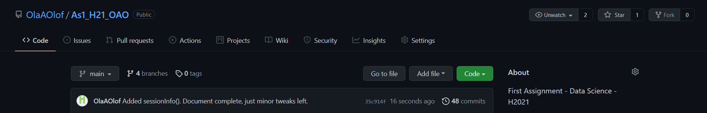

# Introduction

In this document we will look at reproducibility and the importance of it.
In this context, we will address the topic of using "R Notebook" in RStudio.
We'll look into theory regarding reproducibility and R Notebook, which we will also follow up with a discussion.

## What is reproducibility?

In science it's by some considered to be the holy grail of statistics.
Basically it means doing an experiment or research multiple times by different people or groups, with the same numbers and get the same result.
This is desirable because it is important that the findings are robust, trustworthy, and conducted in a satisfactory way.

Researchers often use the terms *replicability* and *reproducibility* interchangeably, but it is useful to distinguish between them.
*Replicability* is "re-performing the experiment and collecting new data," whereas *reproducibility* is "re-performing the same analysis with the same code using a different analyst" @patilStatisticalDefinitionReproducibility2016.
According to @stanovichHowThinkStraight2014, one of the most important criteria for scientists is that the findings are presented in such a way that they can be replicated, exposed for criticism, or extended further on.

## Challenges

One of the big challenges of Data science has been to reproduce the identical results from an earlier research.
In a significant amount of research it has proved hard or flat out impossible to reproduce the results from other peoples and older research for a multitude of reasons.
One of the big reason is quite simply that the data used in the research is unobtainable, due to them being "too old" or lost.
Another reason is the author doesn't want to share the data or can't find it (again, lost).
Other challenges is the usage of different systems, equipment, and so on.
Theories around the research and calculations can also change over time.

## Computable Documents

In more modern times a new idea around this have been brought up: computable documents.
The idea behind this is when publishing a research paper, one submits the data, equations and calculations together with a document that's computable.
That way when other researches wants to run the experiment, they have access to everything, and can see what others did before them.

Computable Document Format (CDF) is an electronic document format designed to allow authoring dynamically generated, interactive content @ComputableDocumentFormat2021.
The format was designed to emprove or kill the PDF by making a document the reader could interact with, by using sliders, menus, and buttons which PDF does not allow.
This consequently increases engagement in the readers and their understanding.

So the question then becomes: can computable documents like R Notebook help with reproducibility?

# Short literature review

According to @mcnuttReproducibility2014 advancing in science is reliant on discoveries that can be trusted, but stated that studies that have been performed, can't be reproduced.
In tandum with this, Peng @pengReproducibleResearchComputational2011 has brought up the idea that reproducibility should be a requirement for publishing research.

Already in the early 1930's the accessability to the data for a research was aired by Frisch He stated that in statistical research, the raw data should be published @frischEditorNote1933.
Later in the 1960's it was deemed nearly impossible to reproduce research on economy with big models.
Then in 1982 there was a research project done: the Journal of Money, Credit and Banking, where they tried to replicate research article with only the submitted data.
This is looking back, very close to reproducibility in modern terms.
The results was a staggering 2 of 70 articles could be reproduced.
They concluded was because for the most part missing data, documentation and computer systems, as quite few of the authors would provide their data and coding @dewaldReplicationEmpiricalEconomics1986.
To counteract this, the idea came up to store the coding and raw data used in research articles, which in a sense is the foundation of computable documents today.

A group of people formed DataCite to gather scientific data all around and storing it on big server and creating a register with all the data, by making cooperations to give data sets unique DOIs.
This would be accesible to everyone, instead of just on the servers of scientific journals @10YearsDataCite.
EU also started an initiative in 2015 called Access to and Preservation of Scientific Information in Europe.
This affects all countries in the EU as well as Turkey and EU associates like Norway.
The idea is to preserve all scientific data and have free access to it for everyone in an effort to lay the foundation for reproducibility @directorate-generalforresearchandinnovationeuropeancommissionAccessPreservationScientific2015.

The last solution that was presented is computable documents.
The idea was to make a document where the code, data, text, etc. were all a direct part of it, and then send it to journals.
This would give the journals, and everyone else interested, access to everything that had been done and all of the data and information in the research.
It would also be possible for the journal and scientist to redo the research with the data, as it was @knuthLiterateProgramming1992.
Donald Knuth is often attributed to being the mastermind behind it, but he never takes the honor, just that be built it upon the ideas of other people and wanted to improve the quality of the code @knuthLiterateProgramming1984.
A group of researches in 1991 used this system to reproduce a research project from mid 1980's that they couldn't reproduce earlier, with success @schwabReproducibleElectronicDocuments1995.

# Discussion

Why is reproducibility in science so important?
It's because the reliability of science is in a way directly connected to being able to reproduce the research multiple times, and ending up with the same result.
If the result changes every time the research is performed, it's an indicator that either the result is wrong or unreliable, or the theory behind it is wrong.

Reproducibility is therefore an important approach that scientists use to gain confidence in their conclusions @mcnuttReproducibility2014.
How confident a conclusion would one be if the scientist could not reproduce the result and conclude similarly again?
She states that this confidence is important regarding the broad scientific community.
This is due to the scientifical knowledge is public in a special sense.
It does not only exist in the mind of the particular researcher, but one could argue that the knowledge does not exist until it has been submitted to the scientific community for criticism and empirical testing @stanovichHowThinkStraight2014.
He elucidates this matter by introducing the term replication.
The term is understood to mean that a finding must be presented to the scientific community in a way that allows fellow scientists to re-do the study and achieve the same results.

According to a analysis conducted by @mcculloughOpenAccessEconomics2009, most economics journals take no substantive measures to ensure that the results they publish are replicable.
Top economics journals have been adopting mandatory data+code archives in the past few years.
The movement toward mandatory data+code archives has yet to reach the open access journals.
Open Access (OA) journals are often perceived, rightly or wrongly, as having a second-class status compared to traditional journals.

Some important points to highlight that can cause problems with reproducibility in R Notebook is:

1.  **System or version incompatibility**

-   Packages, software, etc.

2.  **Advancement or changes in theories**

3.  **Human error**

-   May only be reduced to a certain degree
-   Forgetting to add information and data

4.  **Motivation**

-   Certainty relies on willingness
-   Willingness to turn in all data, code, information, etc.

Firstly, there are different OS and OS platforms, which can create problems.
Software and packages being updated can cause incompatibility and across different versions, as well as errors in the software.
To fix this one needs a huge systematic archive of downloadable software and packages as it was at the time.
Another issue is that a theory about a subject today can change in 20 -- 30 years, which can affect how we go about it and in worst case, calculations and formulas can change.

There's also the human factor.
Human error such as a misunderstanding of the subject or a typo and so on can create follow up mistakes through the document.
In huge documents with 1000s of observations and multiple formulas and calculations can make a small mistake into a big one that can be hard to track and fix, which makes reproducibility borderline impossible.

Finally, there's also willingness.
Creating a big R Notebook or computable document with 1000s of observations, formulas, calculations, analysis, creating data sets and sourcing it all can be a huge workload.
If the person or group takes a shortcut or leaves something out because they think it's not necessary to write down or forgets to add it, we're once again missing information.
Without that information we can't reproduce the research, and if we must ask the author for the data and information they didn't add, part of the point with computable documents for reproducing is lost.
On top of that, we're relying on the author(s) actually having the data on hand or remembering it correctly after potentially years.

R Notebook have a function to make reproducibility more viable, and that is the *sessionInfo()* command in the console.

```{r Session Info}
sessionInfo()
```

Now what does this function do and what does it tell the reader?
Simple: it gives us detailed information about the systems we're using.
The command tells us everything from language, R version, OS platform, base and external packages and it's versions used in this specific document.
This function can help with reproducibility by telling the next group of researchers what system and what they need to reproduce the research and it's result in the document.

Researchers trying to reproduce the results still need to understand and interpret the information and have access to the packages as they were during the research.
An OS platform with the same system and build as it were when the research was performed is also crucial.

# Conclusion

The question was «can R Notebook help with reproducibility?»
.
The short answer is yes, it can help, but it doesn't solve the problem, *atleast not yet*.
There's, as metioned, quite a few issues with the current R Notebook system and computable documents.

The *sessionInfo()* command also goes a long way with reproducing research by giving researchers access to detailed information about what's used in the survey, but as pointed out in the discussion, it's not all green pastures.

To summarize, computable documents like R Notebook definitely helps with reproducibilty, but it doesn't solve the issue fully, atleast not yet.
There are currently too many problems both human and technical.
There's progress in these areas like using identical computer setups from a server, libraries of software and packages, as they were, are currently being developed, the option to check the system for the setup it used when the research was first done, and so on.
So while it doesn't fix the issue, it helps and it's definitely a step in the right direction.

# Reference

::: {#refs}
:::

# Appendix




